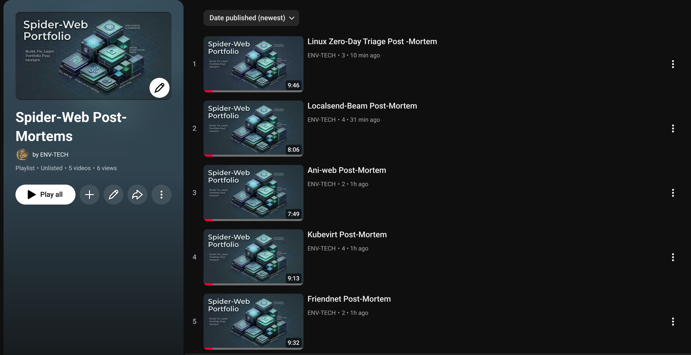

# 🕷️🕸️ Spider-Web-Portfolio

**Who I am:** I'm an entry-level IT support professional (CompTIA A+ certified, Per Scholas IT Support Training grad) who wanted more hands-on experience than a classroom or a cert exam could give me. So the week after finishing my training, I built my own home computer lab and spent 2-3 months teaching myself how real systems actually work by setting them up, breaking them, and fixing them myself.

**What I built:** Three old computers (a MacBook, a beat-up HP laptop, and a mini PC) networked together into one system that runs containerized apps, virtual machines, and automated workflows. Below is a plain breakdown of the skills I picked up doing this, followed by the technical details for anyone who wants to see how it actually works.

## Skills I Practiced Here

- **Troubleshooting across different systems** — My three computers all run different operating systems. Getting them to work together meant learning that a fix on one machine often doesn't work on another, and figuring out why.
- **Diagnosing problems from the ground up** — When something crashed, I didn't just restart it and hope. I read error logs, traced the actual cause, and fixed the root problem.
- **Applying security patches under pressure** — When a real, publicly disclosed Linux security vulnerability came out (CVE-2026-31431) and affected all three of my machines, each one needed a different fix because each one manages its system differently. Full write-up is in the post-mortems below.
- **Building backups and automation** — I set up a system that automatically backs up my configuration files and keeps a record of every change, so I never lose work.
- **Solving problems without help** — No paid tech support to call, no cloud service to fall back on. Everything here got fixed by reading documentation, testing ideas, and trying again when something didn't work.

This repo is the proof: the actual configuration files I wrote, plus first-person write-ups of what broke and how I fixed it.

## Tech Stack

`K3s` `KubeVirt` `CDI` `QEMU` `virtctl` `n8n` `LocalSend` `FriendNet` `Forgejo` `Redis` `PostgreSQL` `SurrealDB` `Ollama` `SearXNG` `Open Notebook` `systemd` `Asahi Linux` `Fedora 43` `Xubuntu` `WSL2` `Docker` `GHCR` `Go` `Python` `Node.js` `Bash` `JavaScript` `npm` `GitHub API` `Google Gemini` `Sway` `Podman` `Alacritty` `Pass` `Starship` `and more...`

---

## Hardware
 
The cluster runs on a strict hardware split across two instruction sets, maximizing resource efficiency across ARM64 and x86_64.
 
| Role | Identity | Architecture | Specs |
|---|---|---|---|
| Control Plane | `gbuntu` | ARM64 | Apple M1 Pro · 16GB Unified Memory · Bare-metal Asahi Ubuntu |
| Worker Node 1 | `hp-stream` | x86_64 | Intel Celeron · 4GB RAM + 2GB Encrypted Swap · Xubuntu |
| Worker Node 2 | `mini-pc` | x86_64 | Intel N100 · 16GB RAM · Windows 11 / WSL2 ("The Tank") |
 
---
 
## Architecture
 
### Running Containers & Virtual Machines
- **K3s** (a lightweight version of Kubernetes) manages all containerized apps and virtual machines across all three computers
- **KubeVirt** runs bare-metal Fedora 43 Virtual Machines as native Kubernetes pods, bypassing macOS's hardware lock on nested virtualization entirely
- `nodeSelector` and `nodeAffinity` rules pin heavy compute to capable nodes, preventing the HP Stream from being OOM-killed by the scheduler
### Telemetry & State (Redis)
A 3-lane Redis setup handles real-time monitoring and state caching across the cluster:
 
| Lane | Node | Function |
|---|---|---|
| Light | HP Stream | Minimal "Alive" heartbeats for edge nodes |
| Medium | Mini PC | Intermediate state caching |
| Powerhouse | M1 Mac | 2GB RAM dedicated to deep state data and infrastructure logs |
 
### File Transfer & Sync
- **LocalSend REST API** — Event-driven "Just-in-Time" data mesh. The n8n control plane fires binary payloads directly across nodes, bypassing the overhead of traditional shared storage
- **FriendNet** — A decentralized Go-based P2P file-sharing tool I integrated into the cluster. Sidecar clients on each node passively sync logs and datasets to each other in the background, so data isn't lost if one node goes down
### Backup Storage
- **External USB drive** — A 128GB USB 3.0 drive formatted to ext4, mounted to the HP Stream node. Physically separate from internal storage, so it survives if that node fails
- **Self-hosted Git server (Forgejo)** — Runs on that external drive, storing all the YAML configs and n8n workflow backups so infrastructure changes are version-controlled, not just live on the cluster
---
 
## AI Stack
 
Inference is handled by Ollama with models pinned to hardware-optimized nodes:
 
| Model | Node | Task |
|---|---|---|
| Gemma 4 | M1 Mac (Unified Memory) | High-speed text reasoning |
| Qwen 3.5 | Mini PC /  | Vision and multimodal tasks |
 
---
 
## Automation Pipeline
 
This public repository is the sanitized output of a private Forgejo instance, published through a fully autonomous n8n pipeline:
 
1. **Private Source Control** — All IaC and configuration files live in a private self-hosted Forgejo Git server
2. **n8n Orchestration** — A custom workflow monitors private Forgejo repositories for changes and triggers the pipeline on every push
3. **Secure Sanitization** — Before any public exposure, an automated module scrubs the code via regex — stripping internal IPs, API keys, credentials, and proprietary configurations
4. **AI Documentation** — A Google Gemini agent analyzes the sanitized code and commit context, then auto-generates or updates README files and architectural overviews
5. **GitHub Publication** — The cleaned, documented output is pushed to this public repository via the GitHub API
 
---
 
## Incident Post-Mortems

[](https://www.youtube.com/playlist?list=PLB26d8r7J0aFxMoEk_CLmKUPlszka4np-)
 
Each major incident in the cluster's build history is documented as a first-person technical post-mortem with a companion video. These aren't tutorials — they're failure reports.
 
| Incident | Core Failure |
|---|---|
| **KubeVirt HCI Build** | 16K page size memory alignment crash — M1 host kills QEMU before first log line |
| **Linux Kernel CVE Patch** | CVE-2026-31431 + CVE-2026-43284 across three architecturally incompatible nodes |
| **FriendNet Data Mesh** | Silent exit 0 cross-compilation failure + Git worktree wipe of 13,429 files |
| **LocalSend / n8n GitOps** | 7-failure cascade across data pipeline amnesia, index locks, and cyclic object crashes |
| **ani-web Containerization** | npm monorepo trap + Node.js version mismatch causing SQLite runtime crash |
 

## Repository Structure
The architecture of this repository is organized to provide clear separation of concerns, facilitating modularity and reflecting the exact deployments running in the K3s environment, alongside the automation workflows that manage them.

```text
.
├── k3s-configs/                     # Core Kubernetes configurations and manifests
│   ├── custom-browser/              
│   │   ├── browser-service.yaml
│   │   ├── firefox.yaml
│   │   ├── pv.yaml
│   │   ├── pvc.yaml
│   │   └── README.md
│   ├── forgejo/                     
│   │   ├── forgejo-deployment.yaml
│   │   ├── forgejo-ingress.yaml
│   │   └── README.md
│   ├── friendnet/                   
│   │   ├── build-friendnet-mac.yaml
│   │   ├── friendnet-edge-builder.yaml
│   │   ├── friendnet-server.yaml
│   │   ├── profile/
│   │   │   └── index.html
│   │   └── README.md
│   ├── media/                       # Media aggregation and streaming infrastructure
│   │   ├── spider-anime/            
│   │   │   └── ani-web/             
│   │   │       ├── ani-web-prod.yaml
│   │   │       ├── data/
│   │   │       │   └── sync_manifest.json
│   │   │       └── README.md   
│   │   └── stremio-web/             
│   ├── n8n/                         
│   │   ├── localsend-bridge.yaml
│   │   ├── n8n.yaml
│   │   └── README.md
│   ├── ollama/                      
│   │   ├── ollama.yaml
│   │   └── README.md
│   ├── open-notebook/               
│   │   ├── open-notebook.yaml
│   │   ├── surrealdb.yaml
│   │   └── README.md
│   ├── postgres/                    
│   │   ├── postgres.yaml
│   │   └── README.md
│   ├── redis/                       
│   │   ├── redis-deployment.yaml
│   │   ├── redis-powerhouse.yaml
│   │   ├── redis-service.yaml
│   │   ├── sentinel-config.yaml
│   │   ├── spider-web-grid.yaml
│   │   └── README.md
│   ├── searxng/                     
│   │   ├── searxng.yaml
│   │   └── README.md
│   ├── system/                      # Core cluster administrative scripts and configurations
│   │   ├── edge-vault-storage.yaml  
│   │   ├── mac-safety-net.yaml      
│   │   ├── resource-limits.yaml     
│   │   └── README.md
│   └── vms/                         # Virtual machine definitions and configs
│       ├── fedora-desktop.yaml
│       ├── fedora-lab.yaml
│       └── README.md
├── Workflow-Backup/                 # n8n automation pipeline and agent backups
│   ├── Creator_workflow-v2.json
│   ├── Creator_workflow-v2.md
│   ├── Creator_workflow-v3_with_Logging.json
│   ├── Creator_workflow-v3_with_Logging.md
│   ├── Editor_workflow-v4.json
│   ├── Editor_workflow-v4.md
│   ├── GitHub_Backup.json
│   ├── GitHub_Backup.md
│   ├── Google_Maps_Email_Scraper.json
│   ├── Google_Maps_Email_Scraper.md
│   ├── infra-backup.json
│   ├── infra-backup.md
│   ├── Localsend-Beam.json
│   ├── Localsend-Beam.md
│   ├── Research_Agent_Sub-Workflow.json
│   └── Research_Agent_Sub-Workflow.md
├── post-mortem/                    # Incident reports
└── Readme.md                        # Master Portfolio documentation
```
